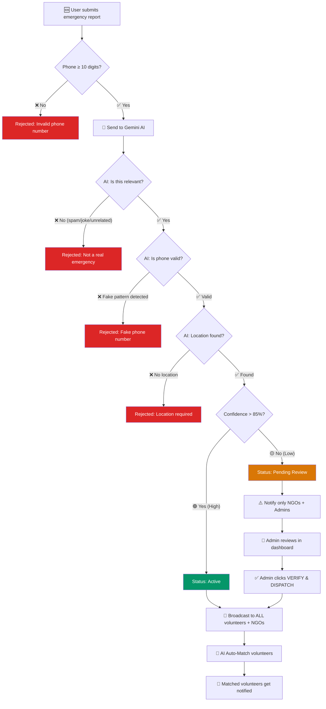

<p align="center">
  
  
  
  
</p>

<h1 align="center">🧠 Impact Hub — AI System Documentation</h1>
<h3 align="center">How AI Powers Every Emergency Request from Submission to Dispatch</h3>

<p align="center">
  <em>Every emergency report passes through a multi-layer AI pipeline that validates, verifies, classifies, and routes it — ensuring only genuine emergencies reach responders, and the right volunteers are matched instantly.</em>
</p>

---

## 📋 Table of Contents

- [AI Pipeline Overview](#-ai-pipeline-overview)
- [Layer 1 — Input Validation](#-layer-1--input-validation)
- [Layer 2 — AI Relevance Gate](#-layer-2--ai-relevance-gate)
- [Layer 3 — Confidence-Based Verification](#-layer-3--confidence-based-verification)
- [Layer 4 — Smart Volunteer Matching](#-layer-4--smart-volunteer-matching)
- [API Routes](#-api-routes)
- [AI Models Used](#-ai-models-used)
- [Emergency Flow Diagram](#-emergency-flow-diagram)
- [Confidence Score UI](#-confidence-score-ui)
- [Admin Verification](#-admin-verification-panel)

---

## 🔄 AI Pipeline Overview

Every emergency report — whether text, voice, or image — flows through a **4-layer AI pipeline** before reaching responders:

```
┌─────────────────────────────────────────────────────────────────────┐
│                    EMERGENCY REPORT SUBMITTED                       │
│              (Text / Voice Transcription / Image)                   │
└──────────────────────────┬──────────────────────────────────────────┘
                           │
                           ▼
              ┌────────────────────────┐
              │   LAYER 1: VALIDATION  │  Phone number check (regex + AI)
              │   ❌ Reject if invalid │  Minimum 10 digits, no fake patterns
              └────────────┬───────────┘
                           │ ✅ Pass
                           ▼
              ┌────────────────────────┐
              │  LAYER 2: RELEVANCE    │  Is this a real emergency?
              │  ❌ Reject if spam     │  AI checks against Impact Hub concept
              └────────────┬───────────┘
                           │ ✅ Relevant
                           ▼
              ┌────────────────────────┐
              │  LAYER 3: CONFIDENCE   │  AI confidence scoring (0-100%)
              │  🟢 >85% = Auto-dispatch│
              │  🟡 ≤85% = Pending Review│
              └────────────┬───────────┘
                           │
                ┌──────────┴──────────┐
                │                     │
         ▼ >85%                ▼ ≤85%
   ┌──────────────┐     ┌──────────────────┐
   │ AUTO-DISPATCH │     │  PENDING REVIEW   │
   │ Status: Active│     │  Notify NGO/Admin │
   │ Broadcast ALL │     │  Wait for verify  │
   └──────┬───────┘     └──────────────────┘
          │
          ▼
   ┌──────────────┐
   │   LAYER 4:   │  AI matches volunteers by skills,
   │ SMART MATCH  │  location, and incident type
   └──────────────┘
```

---

## 🛡️ Layer 1 — Input Validation

**Purpose:** Block invalid data before it even reaches the AI.

### Phone Number Validation (3 Checks)

| Check | Where | Logic |
|-------|-------|-------|
| **Frontend Regex** | `emergency/page.tsx` | Strips non-digits, rejects if < 10 digits |
| **Server Regex** | `api/ai/analyze/route.ts`, `api/ai/vision/route.ts` | Same regex check server-side (defense in depth) |
| **AI Pattern Detection** | Gemini prompt | Detects fake patterns: `0000000000`, `1234567890`, repeated digits |

**Example rejections:**
```
❌ "12345"         → Too few digits (frontend + server block)
❌ "0000000000"    → AI detects repeating pattern
❌ "1234567890"    → AI detects sequential pattern
✅ "9876543210"    → Valid 10-digit number, passes all checks
```

### What the AI checks:

The AI receives the phone number in the prompt and returns:
```json
{
  "phone_valid": true,          // or false
  "phone_issue": null           // or "The number contains only repeating digits"
}
```

If `phone_valid` is `false`, the API returns a **400 error** with the AI's explanation and **no incident is created**.

---

## 🎯 Layer 2 — AI Relevance Gate

**Purpose:** Ensure only genuine disaster/humanitarian/community emergency reports are processed. Reject spam, jokes, unrelated requests.

### What qualifies as "relevant" to Impact Hub:

| ✅ Accepted | ❌ Rejected |
|-------------|-------------|
| Floods, earthquakes, fires | Food delivery orders |
| Medical emergencies | Tech support requests |
| Infrastructure damage | Jokes, memes, random text |
| Evacuations needed | Advertising / spam |
| Water/food/shelter shortages | Personal complaints (non-emergency) |
| Community safety threats | Selfies, food photos (vision) |

### How it works:

The AI prompt explicitly instructs Gemini:

> *"If the report is about something UNRELATED to disaster relief, humanitarian aid, or community emergencies (e.g., ordering food delivery, tech support, jokes, random text, advertising, personal complaints unrelated to emergencies), set `is_relevant` to false."*

The AI returns:
```json
{
  "is_relevant": false,
  "rejection_reason": "This appears to be a food delivery order, not a disaster or humanitarian emergency."
}
```

If `is_relevant` is `false`, the API returns:
```json
{
  "error": "Report not relevant",
  "details": "This appears to be a food delivery order, not a disaster or humanitarian emergency."
}
```

**No incident is created. No notifications are sent. No database records.**

---

## 📊 Layer 3 — Confidence-Based Verification

**Purpose:** Determine if AI is confident enough to auto-dispatch, or if human review is needed.

### The 85% Threshold

```
 0%                        85%                    100%
  |███████████████████████████|██████████████████████|
  |← ── PENDING REVIEW ── →  |← AUTO-DISPATCH ── → |
  |   Notify NGO + Admin      |   Broadcast to ALL   |
  |   Wait for human verify   |   Auto-match volunteers|
```

### Confidence Score Behavior:

| Score Range | Status Set | Who Gets Notified | Auto-Match | Action Required |
|-------------|-----------|-------------------|------------|-----------------|
| **86–100%** | `Active` | All volunteers + all NGOs | ✅ Yes | None — fully automated |
| **0–85%** | `Pending Review` | Only NGOs + Admins | ❌ No | Admin must click "VERIFY & DISPATCH" |

### What determines the confidence score?

The AI evaluates:
- **Clarity of description** — Is the emergency clearly described?
- **Location specificity** — Is a real place mentioned?
- **Category certainty** — Can AI determine Water/Medical/Food/Shelter/Evacuation/Infrastructure?
- **Affected count** — Can the scale be estimated?
- **Consistency** — Does the report make logical sense?

### Text Route (`/api/ai/analyze`):
```json
{
  "confidence_score": 92,      // High confidence → auto-dispatch
  "priority": "CRITICAL",
  "category": "Medical",
  "summary": "Building collapse in Sector 7, 15 people trapped"
}
```

### Vision Route (`/api/ai/vision`):
```json
{
  "confidence": 78,            // Low confidence → pending review
  "severity": "HIGH",
  "damage_type": "Structural damage",
  "description": "Image shows partial building damage, unclear severity"
}
```

### Notification Routing:

**High Confidence (>85%) — Direct Dispatch:**
```
🚨 EMERGENCY: Medical in Sector 7, Ahmedabad
Ravi Kumar reported a CRITICAL emergency. Building collapse, 15 trapped.
Contact: 9876543210 [AI Confidence: 92% — Auto-verified]
```
→ Sent to ALL volunteers + ALL NGOs

**Low Confidence (≤85%) — Review Required:**
```
⚠️ REVIEW NEEDED: Infrastructure in Old City
Anonymous reported an emergency with LOW AI confidence (62%).
This report needs human verification before dispatch.
Contact: 8765432109
```
→ Sent to ONLY NGOs + Admins

---

## 🤝 Layer 4 — Smart Volunteer Matching

**Purpose:** Automatically find and notify the best-fit volunteers for verified emergencies.

> ⚠️ **This layer ONLY runs for high-confidence (>85%) auto-verified incidents.** Pending review incidents skip this step until an admin verifies them.

### How matching works:

1. **Fetch all available volunteers** from the database with their skills, location, and availability
2. **Send incident + volunteer data to Gemini AI** for intelligent matching
3. **AI scores each volunteer** (0-100) based on:
   - Skill relevance (medical skills for medical emergencies, etc.)
   - Geographic proximity
   - Past experience
   - Availability status
4. **Only volunteers scoring ≥50** are notified
5. **Volunteer IDs are validated** against the database (prevents AI hallucinating fake IDs)

### AI Match Output:
```json
{
  "matches": [
    {
      "id": "uuid-of-volunteer",
      "name": "Dr. Priya Sharma",
      "score": 95,
      "reason": "Medical professional located 2km from incident with trauma care experience"
    },
    {
      "id": "uuid-of-volunteer-2",
      "name": "Amit Patel",
      "score": 72,
      "reason": "First-aid certified, available immediately, 5km from location"
    }
  ]
}
```

### Match Notification:
```
🧠 AI Match: Medical in Sector 7
Ravi Kumar reported a CRITICAL incident.
AI matched you (score: 95/100). Medical professional with trauma care experience.
Tap to review and accept. Contact: 9876543210
```

---

## 🔌 API Routes

### `POST /api/ai/analyze` — Text/Voice NLP Engine

| Step | What Happens |
|------|-------------|
| 1 | Receives text report + reporter name + phone |
| 2 | Server-side phone regex validation |
| 3 | Sends to Gemini 2.5 Flash for NLP extraction |
| 4 | AI checks: `is_relevant?`, `phone_valid?` |
| 5 | Rejects if irrelevant or phone invalid |
| 6 | Validates extracted location |
| 7 | Calculates confidence → sets status (`Active` or `Pending Review`) |
| 8 | Creates incident + emergency submission in Supabase |
| 9 | Saves NLP extraction record |
| 10 | Routes notifications based on confidence |
| 11 | Runs volunteer auto-match (if >85% confidence) |

**AI extracts:** `location`, `resource_needed`, `priority`, `affected_count`, `category`, `summary`, `recommended_action`, `volunteers_needed`, `confidence_score`

---

### `POST /api/ai/vision` — Image Damage Assessment

| Step | What Happens |
|------|-------------|
| 1 | Receives image file (or description) + location + phone |
| 2 | Server-side phone regex validation |
| 3 | Converts image to base64, sends to Gemini 2.5 Flash Vision |
| 4 | AI checks: `is_relevant?` (real damage vs selfie), `phone_valid?` |
| 5 | Rejects if irrelevant or phone invalid |
| 6 | Calculates confidence → sets status |
| 7 | Creates incident + submission in Supabase |
| 8 | Routes notifications based on confidence |

**AI extracts:** `severity`, `confidence`, `damage_type`, `description`, `hazards_identified`, `immediate_actions`, `estimated_affected_area`, `infrastructure_status`, `volunteers_needed`

---

### `POST /api/ai/match` — Volunteer Matching Engine

| Step | What Happens |
|------|-------------|
| 1 | Receives incident data (requires auth) |
| 2 | Fetches all available volunteers from database |
| 3 | Sends incident + volunteer profiles to Gemini |
| 4 | AI scores each volunteer (0-100) with reasoning |
| 5 | Validates returned IDs against real database |
| 6 | Creates notification for each matched volunteer |

**AI returns:** `recommended_volunteers[]`, `team_composition_notes`, `coverage_gaps`, `dispatch_priority_order`

---

## 🤖 AI Models Used

| Model | Role | Fallback |
|-------|------|----------|
| **Gemini 2.5 Flash** | Primary model for all AI tasks | Falls back on 503 errors |
| **Gemini 2.5 Flash Lite** | Fallback model when primary is overloaded | — |

Both models are accessed via the `@google/generative-ai` SDK with automatic fallback:

```typescript
try {
  result = await model.generateContent(prompt);    // Try Flash
} catch (e) {
  if (e.status === 503) {
    model = genAI.getGenerativeModel({ model: "gemini-2.5-flash-lite" });
    result = await model.generateContent(prompt);  // Fallback to Lite
  }
}
```

---

## 🔄 Emergency Flow Diagram



---

## 📊 Confidence Score UI

After submitting an emergency, the emergency page displays:

### Radial Confidence Gauge
- **Animated SVG ring** that fills based on confidence percentage
- **Color-coded:** 🟢 Green (>85%), 🟡 Amber (50-85%), 🔴 Red (<50%)
- Shows the exact percentage in the center

### Threshold Visualization
- Gradient bar from red → amber → green
- White marker at the 85% threshold
- Labels: "Review" zone vs "Auto" zone

### Live Feed Badges
- Each incident card shows an `AI: XX%` badge with sparkle icon
- "Pending Review" incidents get amber border + pulsing dot
- "Active" incidents get green dot indicator

### Success Message
- **Auto-verified:** `✅ Emergency auto-verified (AI confidence: 92%) and dispatched`
- **Pending review:** `⚠️ AI confidence: 62% — forwarded to NGO/Admin review team`

---

## 🛡️ Admin Verification Panel

For low-confidence reports that land in "Pending Review":

1. Admin sees pulsing 🟡 amber indicator on the incident row
2. Status shows `● Pending Review` (instead of normal text)
3. A green **VERIFY & DISPATCH** button appears
4. Clicking it:
   - Sets incident status to `Active`
   - Broadcasts `✅ VERIFIED` notification to ALL volunteers + NGOs
   - The incident enters the normal response pipeline

> Standard PROCESS/DISPATCH/RESOLVE buttons are hidden while an incident is in "Pending Review" — the admin MUST verify first.

---

<p align="center">
  <strong>Every emergency passes through 4 AI layers. Only genuine, verified emergencies reach volunteers.</strong>
</p>

<p align="center">
  Built with Gemini 2.5 Flash · Supabase · Next.js · TypeScript
</p>
