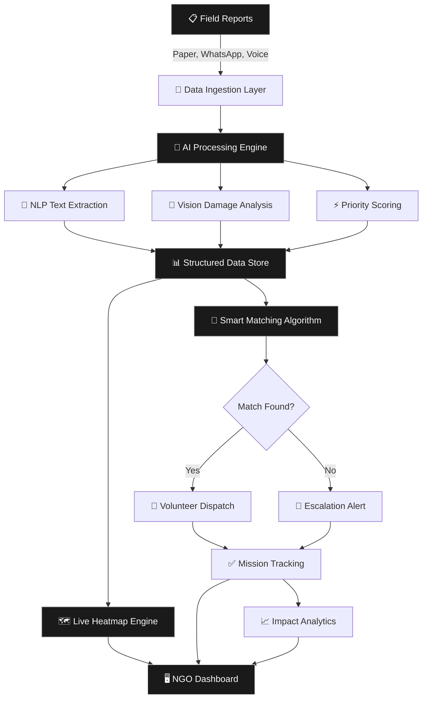
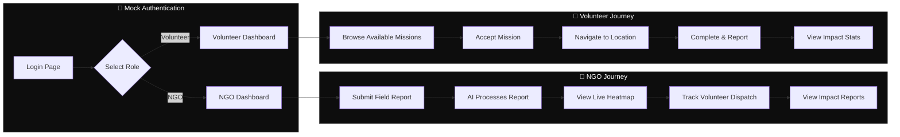
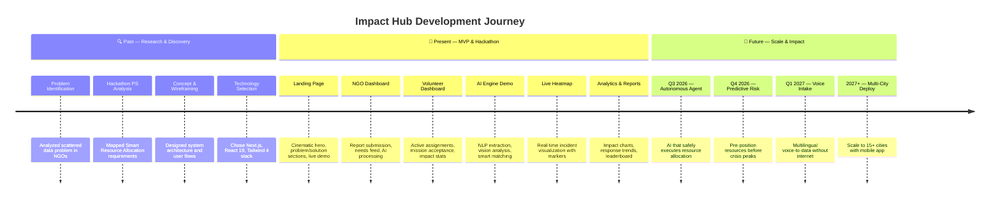

<p align="center">
  
  
  
  
  
</p>

<h1 align="center">Impact Hub</h1>
<h3 align="center">Smart Resource Allocation — Data-Driven Volunteer Coordination for Social Impact</h3>

<p align="center">
  <em>Turn scattered field reports into real-time heatmaps. Match volunteers to urgent needs in seconds, not hours.</em>
</p>

---

## 🎯 Problem Statement

> **[Smart Resource Allocation] Data-Driven Volunteer Coordination for Social Impact**

Local social groups and NGOs collect a lot of important information about community needs through paper surveys and field reports. However, this valuable data is often **scattered across different places**, making it hard to see the biggest problems clearly.

### The Core Challenge

| Problem | Impact |
|---------|--------|
| **Scattered Reports** | Paper surveys, WhatsApp messages, and spreadsheets create chaotic, disconnected data silos |
| **Slow Decisions** | By the time data is compiled, the ground reality has already changed |
| **Poor Coordination** | Volunteers and resources are sent to wrong places, duplicating efforts |

---

## 💡 Objective

Design a powerful system that:

1. **Gathers scattered community information** to clearly show the most urgent local needs
2. **Builds a smart matching engine** to connect available volunteers with specific tasks and areas where they are needed most
3. **Provides real-time intelligence** through live heatmaps and AI-powered analytics

---

## 🚀 Key Features

| Feature | Description |
|---------|-------------|
| **AI Data Extraction** | Messy field reports become structured needs automatically using NLP engines |
| **Vision Damage Analysis** | Upload images for instant hazard severity grading via computer vision |
| **Live Heatmap Intelligence** | Critical zones pulse live on interactive operational maps in real-time |
| **Smart Volunteer Matching** | Nearest skilled responders are automatically dispatched first |

---

## 🏗️ System Architecture



---

## 👤 User Flow



---

## 🛠️ Tech Stack

| Layer | Technology | Purpose |
|-------|-----------|---------|
| **Framework** | Next.js 16 (App Router) | Server & client rendering, routing |
| **UI Library** | React 19 | Component architecture |
| **Language** | TypeScript 5 | Type safety |
| **Styling** | Tailwind CSS 4 | Utility-first CSS |
| **Animations** | Framer Motion 12 | Page transitions, micro-interactions |
| **Scrolling** | Lenis | Smooth scroll experience |
| **Icons** | Lucide React | Consistent icon system |
| **Design** | Glassmorphism + Monochrome | Premium dark UI |

---

## 📅 Past, Present & Future



### Detailed Roadmap

| Phase | Timeline | Milestone | Status |
|-------|----------|-----------|--------|
| **Discovery** | Jan 2026 | Problem research & PS analysis | ✅ Complete |
| **Design** | Feb 2026 | Wireframes & architecture design | ✅ Complete |
| **MVP Build** | Mar–Apr 2026 | Full-stack prototype with all features | 🔨 In Progress |
| **Hackathon** | Apr 2026 | Submit and present at hackathon | 🎯 Current |
| **Autonomous Agent** | Q3 2026 | AI-driven resource allocation | 📋 Planned |
| **Predictive Risk** | Q4 2026 | Historical data analysis for forecasting | 📋 Planned |
| **Voice Emergency** | Q1 2027 | Multilingual voice-to-data pipeline | 📋 Planned |
| **Mobile App** | 2027 | React Native companion app | 📋 Planned |
| **Multi-City** | 2027+ | Deploy across 15+ cities | 🌍 Vision |

---

## 📂 Project Structure

```
impact-hub/
├── public/                    # Static assets
├── src/
│   ├── app/
│   │   ├── globals.css        # Global styles & design tokens
│   │   ├── layout.tsx         # Root layout with providers
│   │   ├── page.tsx           # Landing page
│   │   ├── login/             # Mock sign-in (NGO / Volunteer)
│   │   ├── dashboard/         # Admin command center
│   │   ├── ngo-dashboard/     # NGO-specific dashboard
│   │   ├── volunteer-dashboard/ # Volunteer mission control
│   │   ├── ai-engine/         # AI features showcase
│   │   ├── live-map/          # Full-screen heatmap
│   │   └── reports/           # Analytics & impact reports
│   └── components/
│       ├── layout/
│       │   ├── Navbar.tsx      # Landing page navigation
│       │   ├── Footer.tsx      # Landing page footer
│       │   └── DashboardLayout.tsx  # Shared dashboard shell
│       ├── sections/           # Landing page sections
│       │   ├── HeroSection.tsx
│       │   ├── ProblemSection.tsx
│       │   ├── SolutionSection.tsx
│       │   ├── LiveDemoSection.tsx
│       │   ├── ImpactSection.tsx
│       │   ├── RoadmapSection.tsx
│       │   └── FinalCTASection.tsx
│       ├── providers/
│       │   └── SmoothScroll.tsx
│       └── ui/
│           ├── AnimatedCounter.tsx
│           ├── MagneticButton.tsx
│           └── PageLoader.tsx
├── package.json
├── tsconfig.json
├── next.config.ts
└── README.md                  # ← You are here
```

---

## 🏁 Getting Started

### Prerequisites
- **Node.js** ≥ 18.x
- **npm** ≥ 9.x

### Installation

```bash
# Clone the repository
git clone https://github.com/Deepanshu0211/Impact_hub.git
cd Impact_hub

# Install dependencies
npm install

# Start development server
npm run dev
```

Open [http://localhost:3000](http://localhost:3000) to view the landing page.

### Build for Production

```bash
npm run build
npm start
```

---

## 🗺️ Page Map

| Route | Description | Access |
|-------|-------------|--------|
| `/` | Landing page — Hero, Problem, Solution, Demo, Impact, Roadmap | Public |
| `/login` | Mock sign-in with role selection | Public |
| `/ngo-dashboard` | NGO command center | NGO Role |
| `/volunteer-dashboard` | Volunteer mission control | Volunteer Role |
| `/ai-engine` | AI features interactive demo | Both Roles |
| `/live-map` | Real-time incident heatmap | Both Roles |
| `/reports` | Analytics and impact reports | Both Roles |
| `/dashboard` | Admin command center | Admin |

---

## 🤝 Contributing

Contributions are welcome! Please feel free to submit a Pull Request.

1. Fork the project
2. Create your feature branch (`git checkout -b feature/amazing-feature`)
3. Commit your changes (`git commit -m 'Add amazing feature'`)
4. Push to the branch (`git push origin feature/amazing-feature`)
5. Open a Pull Request

---

## 📄 License

This project is open source and available under the [MIT License](LICENSE).

---

<p align="center">
  Built with ❤️ for <strong>Hackathon Excellence</strong>
</p>
